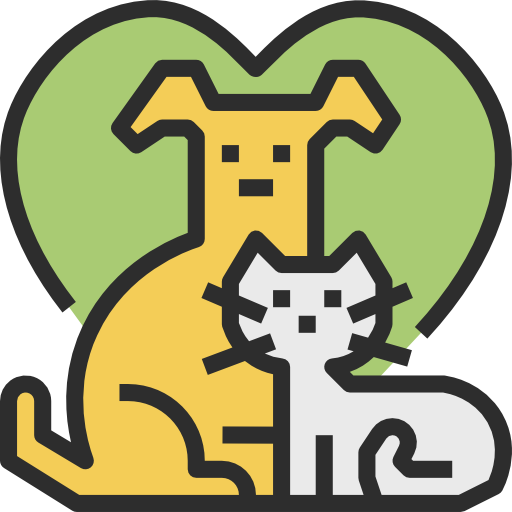

 # 🐰 Wepet - Cuidado e Carinho para seu Pet

<p align="center">
  
  <br>
  <b>Landing page moderna para serviços de pet shop de alta qualidade.</b>
</p>

<p align="center">
   
  
  
  

 
</p>

---

## 📖 Sobre o Projeto

O projeto **Wepet** é uma landing page desenvolvida com foco em fidelidade de design (Pixel Perfect) e performance. Ele apresenta uma interface limpa e intuitiva para que tutores de animais encontrem serviços essenciais como banho, consultas e SPA em um único lugar.

### ✨ Funcionalidades Principais

* 🎯 **Header Estruturado**: Navegação inteligente com logo e menu distribuídos via Flexbox.
* ⚡ **Hero Section**: Área de impacto com CTA (Call to Action) e imagem otimizada.
* 📦 **Grid de Serviços**: Exibição em colunas horizontais utilizando `CSS Grid` para máxima organização.
* 📱 **Totalmente Responsivo**: Experiência fluida em desktops, tablets e smartphones.

---

## 🛠️ Tecnologias e Conceitos

<div align="center">

| Tecnologia | Finalidade | Ícone |
| :--- | :--- | :---: |
| **HTML5** | Estruturação Semântica |  |
| **CSS3** | Estilização e Animações |  |
| **CSS Grid** | Layout de Colunas Complexas | 📐 |
| **Flexbox** | Alinhamento de Componentes | 🔗 |

</div>

---

## 📸 Demonstração Visual

### Tela Inicial (Hero Section)


> Menu com navegação distribuída e área de destaque posicionada com CSS Grid.

<br>

### Nossos Serviços


> Grade de serviços responsiva com três colunas e efeitos de foco (hover).
<br>

### Canais de Atendimento


> Informações de contato estrategicamente posicionadas para facilitar o acesso do cliente.

<br>
---

## ⚙️ Como Executar

```bash
# 1. Clone este repositório
$ git clone [https://github.com/KetlinOlliveira/wepet-leandingpage-html-css.git](https://github.com/KetlinOlliveira/wepet-leandingpage-html-css.git)

# 2. Acesse a pasta do projeto
$ cd wepet-landing-page

# 3. Abra no navegador (ou use a extensão Live Server do VS Code)
$ open index.html
```
🎯 Próximos Passos
<details>
<summary><b>Clique para ver o Roadmap de melhorias futuras do Projeto 🚀</b></summary>


[ ] Animações de Scroll: Adicionar a biblioteca AOS para que os elementos surjam suavemente ao rolar a página.

[ ] Formulário de Contato: Tornar os campos funcionais com validação em tempo real usando JavaScript.

[ ] Modo Escuro (Dark Mode): Implementar uma alternância de cores usando variáveis CSS.

[ ] Otimização de Performance: Converter todas as imagens para o formato .webp para reduzir o tempo de carregamento.

[ ] Seção de Depoimentos: Adicionar um carrossel interativo com fotos e relatos de clientes.

</details>

<div align="center">
<p>Desenvolvido com 🧡 para o portfólio de estudos.</p>
</div>
